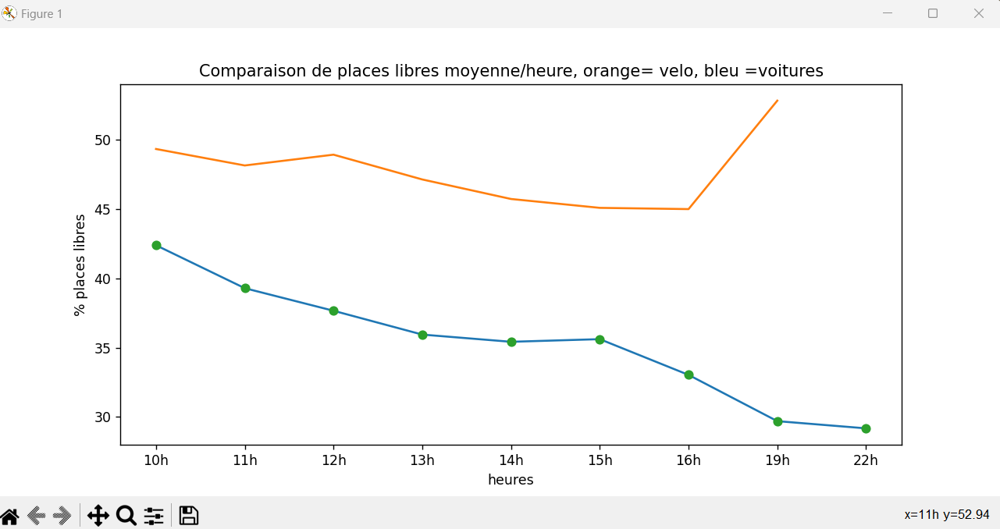

### SAE 15 - MINIPROJET - Akhrouf, El Haouat, Mimouni
# Analyse des données 

## Description du miniprojet  :
 

Durant ce mini projet nous avons écrit plusieurs programmes python, afin de recueillir les données du site open data de Montpellier, dans le but de les analyser.

 

Cette technique, nommée *Web Scrapping* permet de récupérer des informations d’un site, grâce à un programme et de les réutiliser ensuite. En automatisant ce process, on évite ainsi de devoir récolter les données manuellement, et on gagne du temps.

 

## Notre démarche :
 

Premièrement avant de commencer le miniprojet, nous nous sommes posé des questions sur le projet avant de commencer quoi que ce soit. 
- Que demande le cahier des charges ?
- Quels sont les livrables attendus par le client ?
- Comment procéder ?

Nous nous sommes vite reparti les tâches de ce miniprojet après avoir répondu à nos questions.
Vu qu'il fallait utiliser plusieures librairies, nous avons fait une librairie chacun, nous avons 3 librairies. Une pour le recueil des données des parkings voiture, une pour pour le recueil des données des stands vélos, et une autre pour les calculs qu'on devra utiliser lors du traitement de données.

La librairie fonctions_calculs a été fait par Yasir Akhrouf, la librairie fonctions_velomag par Badr Mimouni, et la librairie fonctions_parking par Mohamed-Amine El Haouat.

Puis finalement chacun de nous avons contribué à l'écriture du programme principal.

  

## Analyses des données :
 
Pour l'analyse nous nous sommes consacrés sur  parkings voitures avec leur stand vélo. Nous avons choisis les parkings.

Nous avons calculé la moyenne des pourcentages de remplissage des parkings à chaque heure avec le fichier python nommé TraitementDonnées. 
Ce fichier nous retourne la moyenne des parkings à chaque heure, l'écart type, la covariance et la corrélaton.
  

Voici la représentation du taux de place libre des parkings, avec le taux de vélos libres :

  

 
Sur ce graphe, nous pouvons constater que les vélos ne sont pas vraiment utilisés dans la ville de Montpellier et que les parkings ont un taux d'occupation élevé.

Mais le fait que les vélos ne soient pas utilisés est normal puisque les gens aujourd'hui préfèrent se déplacer en trotinette électrique ou bien en tram.

  
Au vu des données traitées juste au dessus des parkings voitures de la ville de Montpellier et du parking , nous ne pouvons pas établir une corrélation puisque il n'y a aucun lien qui prouve que le parking vélo a un taux d’occupation qui est en relation avec l’usage de la voiture. 

On peut constater que nous avons commencé à récupérer les données le 26 janvier à 10h et que jusqu'à 19h, le nombre de places occupés de  chaque parking choisi varie légèrement. 
